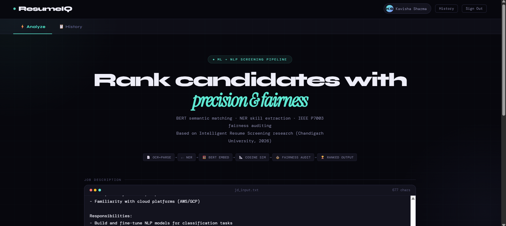
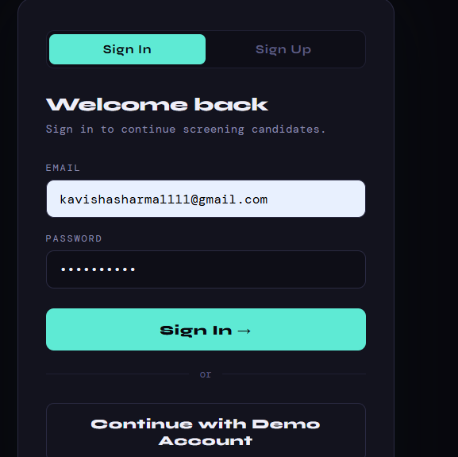
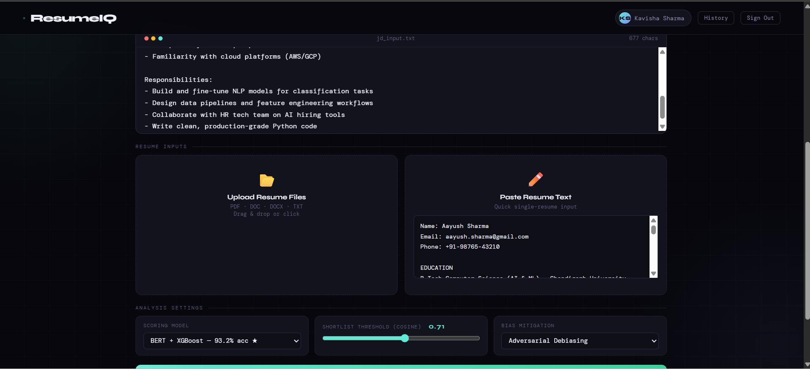
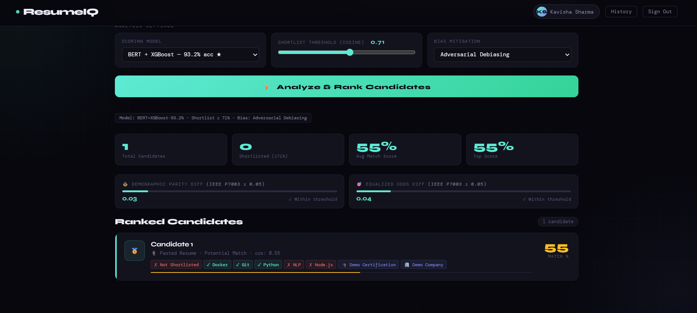

# ResumeIQ — Intelligent Resume Screening System

Full-stack web application for AI-powered resume screening, candidate ranking, and fairness auditing.

Based on the research paper:
> *Intelligent Resume Screening System: A Machine Learning Approach to Automated Talent Acquisition*
> Chandigarh University, 2026

---

## 📸 Screenshots

### 1. Home Page


### 2. Sign In


### 3. Upload & Configure Analysis


### 4. Analysis Results


---

## 📋 Features

- **Resume Analysis**: Upload and analyze resumes in multiple formats
- **Data Extraction**: Automatically extract key information (skills, experience, education, etc.)
- **User Authentication**: Secure login and user management
- **History Tracking**: Keep track of analyzed resumes
- **Web Interface**: Clean and intuitive user interface

## 🛠️ Tech Stack

### Backend
- **Node.js** - Runtime environment
- **Express.js** - Web framework
- **JSON** - Data storage

### Frontend
- **HTML/CSS/JavaScript** - Web interface
- **Responsive Design** - Works on all devices

## 📁 Project Structure

```
resumeiq/
├── backend/
│   ├── routes/          # API endpoints
│   ├── middleware/      # Authentication & custom middleware
│   ├── utils/           # Helper functions and extractors
│   ├── data/            # JSON data storage
│   ├── server.js        # Main server file
│   └── package.json     # Backend dependencies
├── frontend/
│   ├── index.html       # Main HTML file
│   ├── config.js        # Frontend configuration
│   └── package.json     # Frontend dependencies
└── README.md
```

## 🚀 Installation

1. **Clone the repository**
   ```bash
   git clone https://github.com/kavisha1902/ResumeIQ.git
   cd ResumeIQ
   ```

2. **Setup Backend**
   ```bash
   cd backend
   npm install
   ```

3. **Setup Frontend**
   ```bash
   cd ../frontend
   npm install
   ```

## 🔧 Usage

1. **Start Backend Server**
   ```bash
   cd backend
   npm start
   ```

2. **Open Frontend**
   ```bash
   cd frontend
   # Open index.html in your browser
   ```

3. **Upload and Analyze**
   - Navigate to the application
   - Upload a resume file
   - View extracted information and analysis results

## 📝 API Endpoints

- `POST /api/auth/register` - User registration
- `POST /api/auth/login` - User login
- `POST /api/analyze` - Analyze resume
- `GET /api/history` - Get analysis history

## 🔐 Environment Variables

Create a `.env` file in the backend directory with required configurations (see `.env.example`).

## 📄 License

This project is open source and available under the MIT License.

## 👤 Author

**Kavisha**
- GitHub: [@kavisha1902](https://github.com/kavisha1902)

---

**Happy Analyzing! 📄✨**
